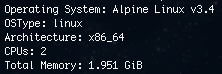
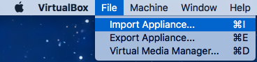
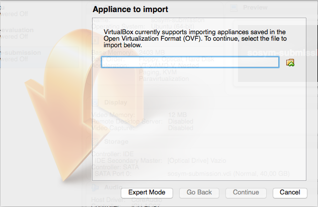
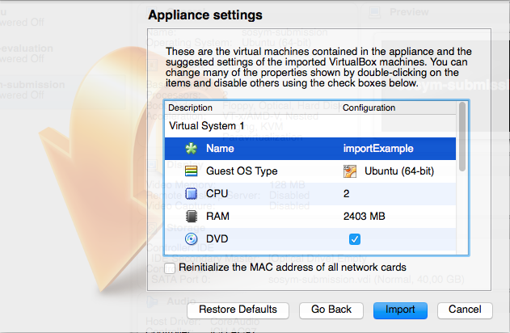
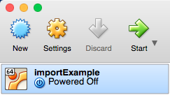
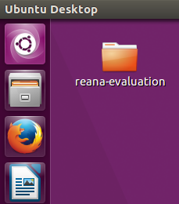
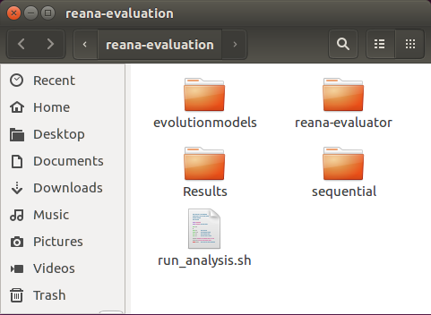

For those whom are interested in replicating our experiment, we provide two
alternative environments containing the ReAna-SPL tool, the artifacts of all
evaluated software product lines (including its evolutions) and the scripts for
results analysis. In the first alternative the environment is packaged into a
Docker container and its usage instructions can be found by clicking
[here](#docker_section). In the second alternative, the environment is packaged
into an linux image suitable to be imported into VirtualBox manager. Its usage
instructions can be found by clicking [here](#vbox_section).

---

## Docker's container

A public [Docker][docker] repository containing the image of the experiment's
environment is available at Docker Hub. It can be accessed directly at the
following URL: [https://hub.docker.com/r/splmc/reana-spl/][reana-docker-repo].

To execute the experiments you must download the environment's image
from ReAna's repository, create a local container (taking the hosting
machine's characteristics into account) and execute the evaluation script inside
the container.  Each step is detailed in the following. 

1. **Downloading the image from Docker Hub:**

In order to download the image from Docker Hub, it is necessary having the
Docker installed and running at the host machine. In case the host machine does
not have the Docker Platform installed, you should follow the install
instructions available [here][docker-download]. 

Once Docker platform is installed and running accordingly, you can download the
image containing the experiment environment by typing the following instruction
at a terminal of the host machine: 


docker pull splmc/reana-spl:istSubmission


The image's size is around 526 MB, so the download may take some time depending
on your connection speed. 

{:start="2"}
2. **Creating the container:** 

Before creating the experiment's container it is approppriate to know which are
the host's resources. Docker platform provides the following command for showing
such information at a terminal:


docker info


The host's characteristics considered for the experiment replication are the
number of CPUs and amount of main memory. The command's output shows such values
according to the following picture.

**Note 1:** in case the host machine contains a hyper-thread processor, you
can consider the number of available CPUs as the double of the value shown by
the `docker info` command's output.

**Note 2:** the `Total Memory` shown must not be entirely used by the experiment
container, so it does not imposes much pagination during the analysis execution.

[Table 1](#Table1) shows the environment characteristics where our experiment
was executed and it comprises both host machine and container's characteristics.

|                         |      Host machine         |Docker container|
|:------------------------|:-------------------------:|:--------------:|
|**CPU model**            |Intel i5-4570TE, 2.70 Ghz  |       ---      |
|**\#CPU's cores**        |  4 (hyperthreaded) cores  |     4 cores    |
|**OS**                   |  64-bit CentOs Linux 7    |Ubuntu 16.04 LTS|
|**Main memory (Gb)**     |           8 Gb            |      6 Gb      |

_**Table 1:** specifications of host machine and the experiment container._

Our experiment environment used 100% of available CPUs and 75% of the main
memory. Such values must be taken into account when replicating the experiment,
so the replication container resembles our experiment environment as much as
possible. To create the container from an docker image and define how it uses
the host's resources you should execute the following instruction at a terminal
replacing the values between **[** and **]** by the appropriate values.


docker run -dt 
           --cpuset-cpus [min-max] 
           --memory [amount unit] 
           --name [name] 
           [image:tag] 
           /bin/bash


*Example:* for creating a docker container named `scalabilityAnalysis` similar
to the described by [Table 1](#Table1), the instruction for creating it would
be:


docker run -dt 
           --cpuset-cpus 0-3 
           --memory 6Gb 
           --name scalabilityAnalysis 
           reana-spl:istSubmission 
           /bin/bash


{:start="3"}
3. **Running the evaluation script:**

Once the experiment container had been created from docker image, the next step
is to execute the script that triggers the reliability analysis of the software
product lines. To access the containers's terminal, execute the following
instruction from host's terminal, replacing `[name]` by the container's name you
provided the previous step:


docker exec -ti [name] /bin/bash
 

_Example:_ considering the previous example, the command line for accessing the
created container would be: 


docker exec -ti scalabilityAnalysis /bin/bash


The file `run-analysis.sh` (inside the experiment's folder `/reana-evaluation`
the root folder) contains the experiment script for performing the analysis of
software product lines.  Such script may receive a value for the `--times`
parameter to define how many times each analysis strategy will be executed for
each evolution of each software product line. In absence of this parameter the
evaluation script assumes 10 as default number for iterations. The instructions
for accessing and starting the evaluation script are shown below. 


root@90c8d1e0e689:/# cd reana-evaluation/
root@90c8d1e0e689:/reana-evaluation# ./run_analysis.sh 


**Note 3:** the container will always start a `root` session.  
**Note 4:** each created container will receive an `id` (in the example above
the container's id is `90c8d1e0e689`). Such value will be different for the
container that you will create. 

The script will execute all analysis performed for the software product lines
and their evolutions presented at the paper. As it may take a long time to
finish it is recommended choosing a reasonable number of iterations for the
execution of the strategy analysis. In order to execute the statical analysis,
the number of iterations can not be less than 8. 

{:start="4"}
4. **Getting the analysis results**

As soon as the evaluations of all software product lines finish the statistical
analysis takes place for summarizing the analysis' results, applying the
suitable statistical tests and outputs its results by graphs and a report. Such
resuts are grouped by software product lines and show how each analysis strategy
demands time and space as the software product line evolves. All results of
statistical analysis are packaged at the file `results.tar.bz` inside the
`reana-evaluation` folder. 

In order to view its content it is necessary copy `results.tar.bz` file to the
host machine and extract its content. The file transfer from the experiment
container to the host machine is accomplished by the instruction shown below. In
a host's terminal type the following instruction, replacing `[name]` by the
container name: 


docker cp [name]:/reana-evaluation/results.tar.bz .


_Example_: considering out container example, the command line for copying the
results to the host machine would be:

docker cp scalabilityAnalysis:/reana-evaluation/results.tar.bz .


After the file transfer finishes, the file `results.tar.bz` will be available at
your working directory. With the extracting tool of your preference, you must
open and extract the file. The results will for each software product line will
be available in its own folder. 

---

## Linux image

Another alternative for the experiment replication is by using the environment
image we created for [VirtualBox][virtual-box], a virtual machine manager provided
by Oracle&copy;. To use this alternative it is necessary having a host
machine with VirtualBox installed and a copy of the environment image.  In case
it is necessary installing VirtualBox, its binaries for different platforms can
be downloaded from [here][virtual-box-download]. The installation instructions
are available [here][virtual-box-installation]. 

Next we present the steps for importing the replication environment into
VirtualBox and running the experiment script.

1. **Downloading and importing the Linux image into VirtualBox&copy;**

The Linux image containing the replication environment is available at the
repository created for this paper submission. To download the image file,
please refer to the file named `replicationEnvironment.tar.bz` at [GitHub
repository][submission-github] or simply click [here][submission-image]. 

After downloading the `replicationEnvironment.tar.bz` file it is necessary
extract its content using the decompression tool of your preference. The
extraction's result is a file named `reana-replicationEnvironment.ova`. This
file is now ready to be imported to VirtualBox Manager tool. 

To import the image into VirtualBox, choose the `Import appliance` option from
the `File` menu, as shown below.

The path for the `reana-replicationEnvironment.ova` file must be provided at the
new window, as shown by the figure below. After informing the file path, click
on "Continue" to proceed.

In the next screen, represented by the figure below, VirtualBox will show you
the characteristics of the virtual machine you are creating. The values for each
characteristic, in special the number of CPUs and memory, must be changed
considering the hosts machine resources. In our experiments we used 100% of CPUs
(considering the hyperthreaded cores) and 75% of the memory -- please refer to
[Table 1](#Table1). Thus, you should consider such values for resources usage
when creating your virtual machine so it resembles our experiment environment as
much as possible.  

The next step will be the conclusion of the virtual machine import. When it is
finished, the virtual machine will be ready to be executed. 

{:start="2"}
2. **Executing the evaluation script**

After importing the environment image into VirtualBox, a new virtual machine
(named according to the value informed at last step) is available to be used.
To start the virtual machine, select it from the list of available virtual
machines and click at "Start" button. The figure below depicts this step.

In the Virtual Machine's desktop there is a folder named `reana-evaluation`, as
shown by the figure below. It contains all artifacts needed for replicating our
experiment, so it comprises all the software product line's models, the analysis
tools and the scripts for the analysis automation. 

The file `run_analysis.sh` inside the `reana-evaluation` folder contains the
script for automating the reliability analysis of the software product lines.
Thus, it role is to trigger the execution of the ReAna-SPL tool and, when all
analysis finish, it groups the results of each software product line and perform
the statistical tests. The results (graphs and report) will be available at the
folder `Results`. 

The default number of analysis iterations for each strategy/software product
line is `10`. However, such value can be changed by assigning a value for the
parameter `--times`. For executing the automation script, in a terminal of the
virtual machine you should type the following commands


cd ~/Desktop/reana-evaluation
./run_analysis.sh


In case you want to define the number of analysis iterations, you need change
the last command, by adding the `--times` parameter, as shown below:


./run_analysis.sh --times XX
 
where `XX` is the number of iterations.

**Note 5:** although the `--times` parameter can assume an arbitrary positive integer
value, it must must be greater than `8` in order to allow drawing valid
conclusions from the statistical analysis.

**Note 6:** due the number of software product lines (and its evolutions), the
analysis strategies and the time required for each combination analysis/software
product line, it is recommended choosing a reasonable value for `--times`
parameter so it answers in a practical time.

[docker]:                   https://docker.com/
[docker-download]:          https://www.docker.com/products/docker
[reana-docker-repo]:        https://hub.docker.com/r/splmc/reana-spl/
[virtual-box]:              https://www.virtualbox.org/
[virtual-box-download]:     https://www.virtualbox.org/wiki/Downloads
[virtual-box-installation]: https://www.virtualbox.org/manual/ch02.html
[submission-github]:        https://github.com/andrelanna/sosym-submission
[submission-image]:         https://link.to.a.file

